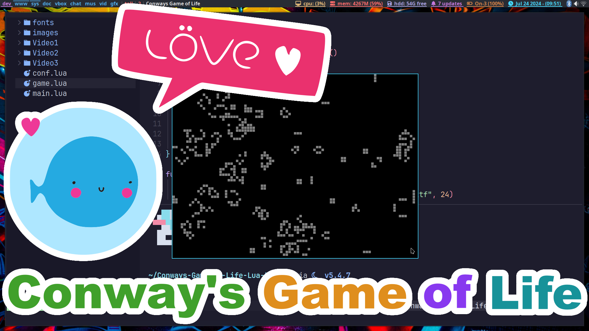

# Conway's Game of Life (Lua - Love2D)
Conway's Game of Life is a classic cellular automaton devised by British mathematician John Horton Conway in 1970. It's a zero-player game, meaning its evolution is determined by its initial state, with no further input from humans. Despite its simplicity, the Game of Life exhibits complex and fascinating patterns.

* If a dead cell has exactly three live neighbors, it becomes alive in the next generation.
* If a live cell has two or three live neighbors, it remains alive in the next generation.
* In all other cases, a cell dies or remains dead.

# Run
You will need to make sure Love2D is installed.

ArchLinux instructions.
```
sudo pacman -S --needed love
cd
git clone https://github.com/ProgrammingRainbow/Conways-Game-of-Life-Love2D
cd Conways-Game-of-Life-Love2D
love .
```
# Controls
Up Arrow - Speeds up the game.\
Down Arrow - Slows down the game.\
Space Bar - Pauses the game.\
Escape - Quits the game.\
R - Resets and randomizes the board.\
C - Clears the board.\
Mouse Click - Toggles a cell on/off.
